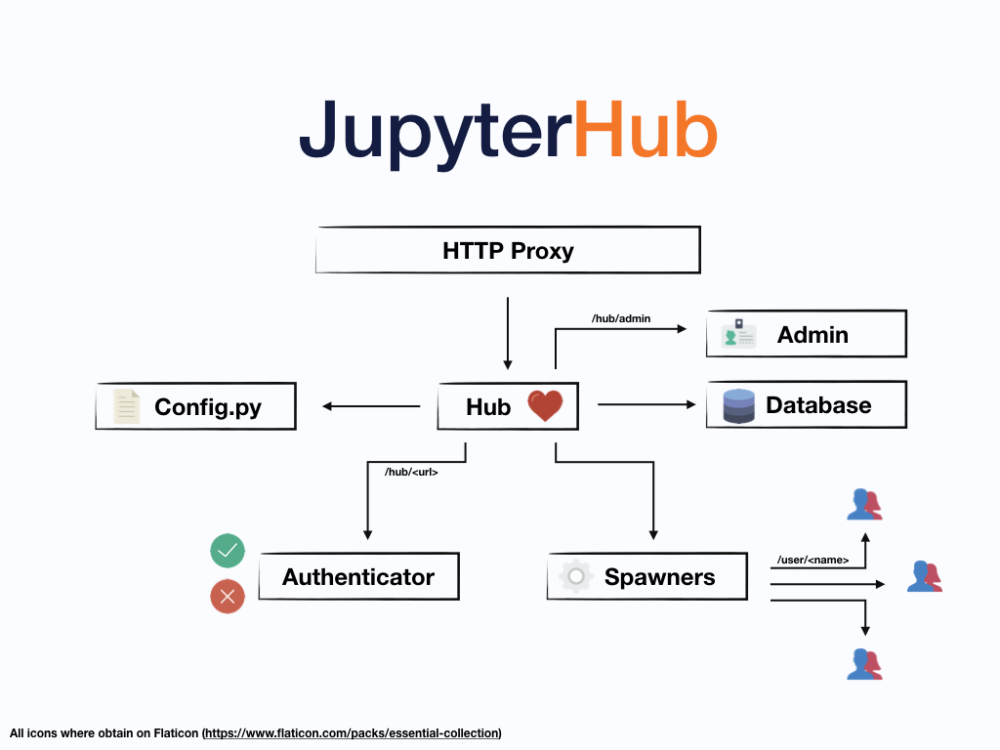

# **LMS-JupyterHub-Plugin** 

This work is inspired by [this](https://github.com/CSSPLICE/webcatjupyterplugin) repository.

**LMS-JupyterHub-LTI**

The goal of this project is the following:
* Build a Jupyterlab plugin to send a score/grade from a given notebook to a LMS through LTI

---

### Reflection

### 1. What is JupyterHub/Lab?

JupyterHub is the best way to serve Jupyter notebook for multiple users. 
It can be used in a class of students, a corporate data science group or scientific research group. 
It is a multi-user Hub that spawns, manages, and proxies multiple instances of the single-user Jupyter notebook server.

## How does it work

JupyterHub performs the following functions:
    
*  The Hub launches a proxy
*   The proxy forwards all requests to the Hub by default
*   The Hub handles user login and spawns single-user servers on demand
*   The Hub configures the proxy to forward URL prefixes to the single-user notebook servers

### Components

Four subsystems make up JupyterHub:

*  a Hub (tornado process) that is the heart of JupyterHub
*  a configurable http proxy (node-http-proxy) that receives the requests from the client’s browser
*  multiple single-user Jupyter notebook servers (Python/IPython/tornado) that are monitored by Spawners
*  an authentication class that manages how users can access the system

Besides these central pieces, you can add optional configurations through a config.py file and manage users kernels on an admin panel. 

A simplification of the whole system can be seen in the figure below:

### 2. Pipeline Description and Installation

## Installation steps:

1. pip3 install git+https://github.com/Melhaya/LMS-JupyterHub-Plugin
2. jupyter serverextension enable --py webcatjupyterplugin
3. jupyter nbextension install --py webcatjupyterplugin
4. jupyter nbextension enable --py webcatjupyterplugin
